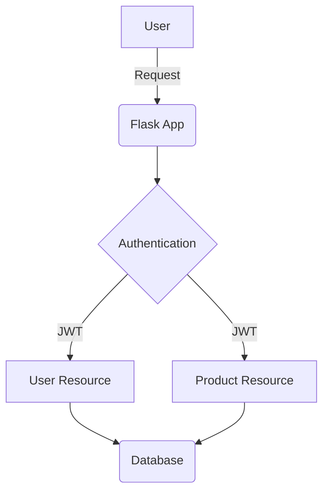

# Tech Hunter REST API

## Description

This project is a REST API for a Tech Hunter application. It allows users to manage products and user authentication.

## Project Structure

The project follows a modular structure:

```
├── app
│   ├── __init__.py
│   ├── app.py
│   ├── blocklist.py
│   ├── extensions.py
│   ├── models
│   │   ├── __init__.py
│   │   ├── product.py
│   │   └── user.py
│   ├── requirements.txt
│   ├── resources
│   │   ├── __init__.py
│   │   ├── product.py
│   │   └── user.py
│   └── schemas.py
├── migrations
│   ├── README
│   ├── alembic.ini
│   ├── env.py
│   └── script.py.mako
├── test
│   ├── __init__.py
│   ├── base_test.py
│   ├── system
│   │   ├── __init__.py
│   │   ├── test_products.py
│   │   └── test_user.py
│   └── unit
│       ├── __init__.py
│       ├── models
│       │   ├── __init__.py
│       │   ├── test_products.py
│       │   └── test_user.py
├── Dockerfile
├── README.md
├── __init__.py
└── docker-compose.yaml
```

- **`app/app.py`**: Main application file, creates the Flask app and initializes extensions.
- **`app/models`**: Contains the SQLAlchemy models for `Product` and `User`.
- **`app/resources`**: Defines the API endpoints using Flask-Smorest Blueprints.
- **`app/schemas.py`**: Marshmallow schemas for data serialization and validation.
- **`app/extensions.py`**: Initializes extensions like `db`.
- **`app/blocklist.py`**: Manages the blocklist for JWT tokens.
- **`migrations`**: Alembic migrations for database schema changes.
- **`test`**: Contains unit and system tests.
- **`Dockerfile`**: Defines the Docker container for the application.
- **`docker-compose.yaml`**: Docker Compose file for running the application and its services.

## API Endpoints

The API has two main resources:

- **Products**: `/api/products`
- **Users**: `/api/users`

The API documentation is available at `/swagger-ui`.

## Dependencies

The main dependencies are:

- Flask
- Flask-Smorest
- SQLAlchemy
- Flask-SQLAlchemy
- Flask-JWT-Extended
- passlib
- psycopg2
- marshmallow-sqlalchemy
- python-dotenv
- Flask-Cors
- Flask-Migrate
- gunicorn

## Docker

The application can be run in a Docker container. The `Dockerfile` and `docker-compose.yaml` files are provided.

To build and run the container:

```bash
docker-compose up --build
```

## Mermaid Diagram


